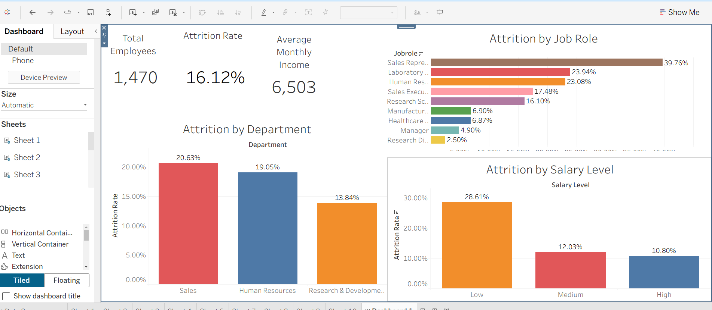

# 📊 HR Attrition Analysis (SQL + Python + Tableau)

This project analyzes employee attrition data to uncover patterns and key drivers behind employee turnover.  
The goal is to transform raw HR data into actionable business insights using SQL, Python, and Tableau.

---

## 📌 Project Overview

Employee attrition is a critical business problem that affects costs, productivity, and company culture.

This analysis answers key questions such as:

- What is the overall attrition rate?
- Which job roles have the highest attrition?
- How does salary level impact employee turnover?

---

## 🛠️ Tools Used

- **SQL (MySQL)** → data extraction and preparation  
- **Python (Pandas, Matplotlib)** → data cleaning and exploratory analysis  
- **Tableau** → interactive dashboard and visualization  

---

## 📂 Project Structure

```text
hr-attrition-analysis/
│
├── sql/
│   ├── schema.sql
│   ├── data_import.sql
│   └── analysis_queries.sql
│
├── python/
│   └── hr_analysis.ipynb
│
├── tableau/
│   └── hr_dashboard.twbx
│
├── data/
│   └── hr_data.csv
│
├── images/
│   ├── attrition_by_jobrole.png
│   ├── attrition_by_salary.png
│   ├── attrition_by_department.png
│   └── attrition_overview.png
│
└── README.md
```

---

## 🧹 Data Cleaning Process

The dataset required preprocessing before analysis:

- Converted **Attrition (Yes/No)** into numeric values (1/0)
- Handled missing values where necessary
- Standardized column names
- Verified data consistency between tools (SQL → Python → Tableau)

---

## 📊 Key Insights

### 🔹 Overall Attrition Rate
- Calculated using a binary transformation (Yes = 1, No = 0)
- Provided a clear percentage of employees leaving the company

---

### 🔹 Attrition by Job Role

- Some roles show significantly higher turnover
- Indicates potential issues in workload, expectations, or compensation

---

### 🔹 Attrition by Salary Level

- Lower salary levels tend to have higher attrition
- Suggests compensation is a strong retention factor

---

### 🔹 Attrition by Department

- Certain departments are more affected than others
- Helps HR focus retention strategies

---

### 🔹 General Overview


- Combines key metrics into a single dashboard for decision-making

---

## 📈 Business Impact

This analysis helps companies:

- Identify high-risk employee segments  
- Improve retention strategies  
- Optimize salary structures  
- Increase employee satisfaction  

---

## 🚀 Key Skills Demonstrated

- Data cleaning and transformation  
- SQL joins and aggregations  
- Python exploratory analysis  
- Data visualization with Tableau  
- Business-oriented thinking  

---

## 👤 Author

**Rayan Serratine**  

Data Analytics Portfolio  
Vancouver, Canada  
